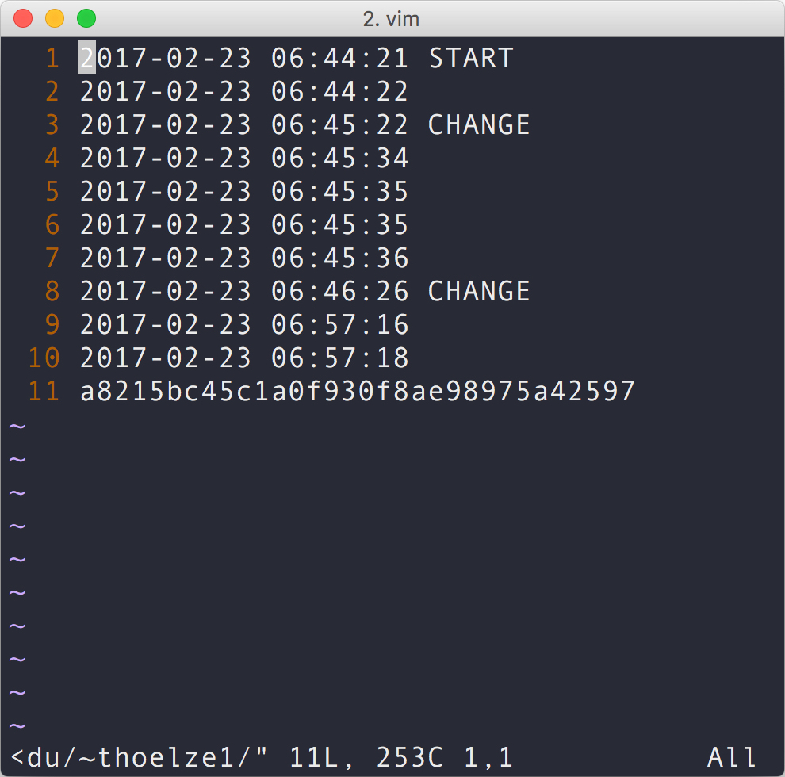

# Tracking Web Content
Compare current and stored snapshots of websites to determine when content at a URL has changed. Start tracking by cloning the repository, specifying URLs, and executing the script.

    git clone https://www.github.com/thoelze1/web-content-tracker.git
    python get-pip.py --user
    pip install twilio
    vi web-content-tracker/data/urls.txt
    python track-urls.py &

## Input URLs
The script expects each line of data/urls.txt to contain exactly one URL and nothing else.

## Storing Snapshots
A text file (URL log) tracks changes for each URL. Content at a URL is saved as an MD5 hash and updated regulary. Each new hash is compared to the existing hash. For each comparison, the corresponding log is timestamped and change is noted when present.

## URL Logs
Each URL log contains a series of timestamps followed by the previous MD5 hash. Below is a log for [a mirror of my website](http://bingweb.binghamton.edu/~thoelze1/).

  

## Dangers
Saving files without sanitizing them can be dangerous.
